 

## 👋 About Me

I'm a **Computer Science student at UT Dallas** building things at the intersection of
**machine learning and real products** — from real-time computer-vision systems to
full-stack AI apps.

- 🤖 Focused on **Computer Vision, NLP & Deep Learning**
- ⚡ Recently built a **C++ trading exchange engine** and an **athlete injury prediction model**
- 🏆 Hackathon regular — **YHack, Goldman Sachs, NSBE**
- 📚 Currently learning **Transformers, Diffusion Models & MLOps**
- 🕹️ Once wrote a **fully playable game in pure MIPS Assembly** (and lived to tell the tale)

 

## 🛠️ Skills & Tech Stack

| Category | Technologies |
|:--|:--|
| 🧠 **Machine Learning & AI** |       |
| 👁️ **Computer Vision & NLP** |     |
| 🌐 **Web & App Development** |       |
| 🗄️ **Languages & Databases** |       |
| 🔧 **Tools & Platforms** |      |

## 🌟 Featured Projects

### 📂 All Projects

| Project | What it does | Built with |
|:--|:--|:--|
| ⚙️ [**Trading Exchange Engine**](https://github.com/sans-2186/Trading-Exchange-Engine) 🆕 | High-performance order-matching exchange engine | `C++` |
| 🏃 [**Athlete Injury Prediction**](https://github.com/sans-2186/Athlete-Injury-Prediction-Model) | ML model forecasting athlete injury risk | `Python` `scikit-learn` |
| 🎭 [**ACM Facial Detection**](https://github.com/sans-2186/ACM-Facial-Detection-System) | Real-time face recognition + automated attendance | `Python` `OpenCV` `Node.js` |
| 📡 [**Signal**](https://github.com/sans-2186/YHack-26-Signal) | AI-powered investment intelligence dashboard (YHack) | `FastAPI` `React` |
| 🌲 [**StockQuest**](https://github.com/sans-2186/GS-Hackathon-2026) | Forest-adventure investing game (Goldman Sachs Hackathon) | `Next.js` `Claude AI` |
| 🖼️ [**Image Classification**](https://github.com/sans-2186/Image-Classification) | CNN classifying MNIST handwritten digits | `TensorFlow` `Keras` |
| 🎬 [**Movie Sentiment Analysis**](https://github.com/sans-2186/Movies-Review-Sentimental-Analysis-App) | NLP engine for movie review sentiment | `NLTK` `scikit-learn` |
| ✈️ [**Airline Fare Calculator**](https://github.com/sans-2186/Airline-fare-calculator) | OOP ticketing system with seat maps | `Java` |
| 🌍 [**Wellness Dashboard**](https://github.com/sans-2186/UNT-NSBE-Hackathon-2025) | Global health data explorer (NSBE Hackathon) | `Streamlit` `Plotly` |
| 🐾 [**WhiskerWorld**](https://github.com/sans-2186/WhiskerWorld-Where-pets-find-love) | Pet adoption platform | `Python` `MySQL` |
| 🕹️ [**MIPS Black Hole Game**](https://github.com/sans-2186/MIPS-Black-Hole-Game) | Fully playable game written in pure Assembly | `MIPS` |
| 🌐 [**Portfolio Website**](https://github.com/sans-2186/sanskriti-portfolio) | Personal portfolio + mentor curriculum | `React` `HTML` `CSS` |

<b>🎓 AI-201 Coursework Series — 10+ hands-on AI/ML labs & projects</b>

 

| Project | Focus |
|:--|:--|
| [Provenance Guard](https://github.com/sans-2186/ai201-project4-provenance-guard) | AI content provenance & verification |
| [TakeMeter](https://github.com/sans-2186/ai201_project3_takemeter_starter) | Data analysis in Jupyter |
| [FitFindr](https://github.com/sans-2186/ai201-project2-fitfindr-starter) | Recommendation logic in Python |
| [Unofficial Guide](https://github.com/sans-2186/ai201-project1-unofficial-guide-starter) | Python fundamentals project |
| [Mixtape](https://github.com/sans-2186/ai201-project5-mixtape-starter) · [Grocery List](https://github.com/sans-2186/ai201-lab6-grocerylist-starter) · [Book Club](https://github.com/sans-2186/ai201-lab5-bookclub-starter) · [RepairSafe](https://github.com/sans-2186/ai201-lab4-repairsafe-starter) · [PodClassifier](https://github.com/sans-2186/ai201-lab3-podclassifier-starter) · [PlantAdvisor](https://github.com/sans-2186/ai201-lab2-plantadvisor-starter) · [RulesBot](https://github.com/sans-2186/ai201-lab1-rulesbot-starter) | Weekly applied-AI labs |

## 📊 GitHub Analytics

  
  

  

  

## 🤝 Let's Connect

*"The goal is to turn data into information, and information into insight."*

 

